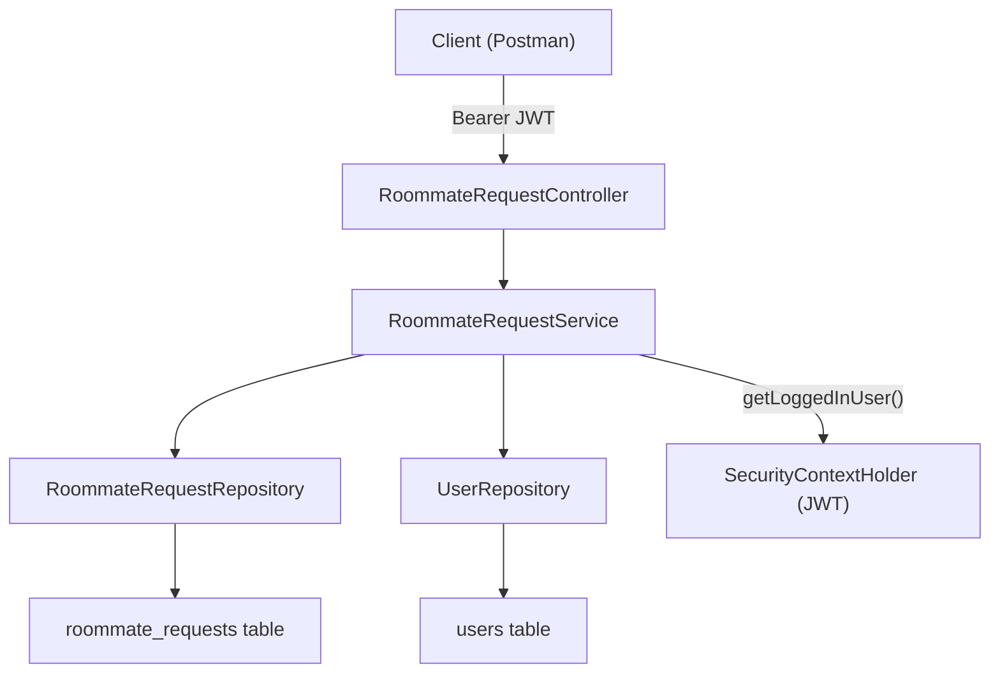

# Roommate Request System — Implementation Walkthrough

## Files Created (7 files)

| Layer | File | Purpose |
|-------|------|---------|
| **Entity** | [RequestStatus.java](file:///x:/RM_Project/RoomieMatch-AI/src/main/java/com/roomiematch/roomiematchai/entity/RequestStatus.java) | Enum: `PENDING`, `ACCEPTED`, `REJECTED` |
| **Entity** | [RoommateRequest.java](file:///x:/RM_Project/RoomieMatch-AI/src/main/java/com/roomiematch/roomiematchai/entity/RoommateRequest.java) | JPA entity with `@ManyToOne` to User (sender & receiver) |
| **Repository** | [RoommateRequestRepository.java](file:///x:/RM_Project/RoomieMatch-AI/src/main/java/com/roomiematch/roomiematchai/repository/RoommateRequestRepository.java) | JpaRepository with finder methods |
| **DTO** | [RoommateRequestDTO.java](file:///x:/RM_Project/RoomieMatch-AI/src/main/java/com/roomiematch/roomiematchai/dto/RoommateRequestDTO.java) | Input DTO (only `receiverId`) |
| **DTO** | [RoommateRequestResponseDTO.java](file:///x:/RM_Project/RoomieMatch-AI/src/main/java/com/roomiematch/roomiematchai/dto/RoommateRequestResponseDTO.java) | Response DTO with sender/receiver details |
| **Service** | [RoommateRequestService.java](file:///x:/RM_Project/RoomieMatch-AI/src/main/java/com/roomiematch/roomiematchai/service/RoommateRequestService.java) | Business logic + all validations |
| **Controller** | [RoommateRequestController.java](file:///x:/RM_Project/RoomieMatch-AI/src/main/java/com/roomiematch/roomiematchai/controller/RoommateRequestController.java) | REST endpoints |

---

## Architecture Diagram



---

## API Endpoints

### 1. `POST /requests/send` — Send a Request
**Headers:** `Authorization: Bearer <token>`

**Body:**
```json
{
  "receiverId": 2
}
```

**Response (201):**
```json
{
  "message": "Roommate request sent successfully",
  "data": {
    "id": 1,
    "senderId": 1,
    "senderEmail": "alice@example.com",
    "receiverId": 2,
    "receiverEmail": "bob@example.com",
    "status": "PENDING",
    "createdAt": "2026-04-16T22:40:00"
  }
}
```

---

### 2. `GET /requests/incoming` — View Incoming Requests
**Headers:** `Authorization: Bearer <token>`

**Response (200):**
```json
{
  "message": "Incoming requests retrieved successfully",
  "data": [
    {
      "id": 1,
      "senderId": 1,
      "senderEmail": "alice@example.com",
      "receiverId": 2,
      "receiverEmail": "bob@example.com",
      "status": "PENDING",
      "createdAt": "2026-04-16T22:40:00"
    }
  ]
}
```

---

### 3. `GET /requests/sent` — View Sent Requests *(bonus endpoint)*
**Headers:** `Authorization: Bearer <token>`

---

### 4. `PUT /requests/respond` — Accept or Reject
**Headers:** `Authorization: Bearer <token>`

**Body:**
```json
{
  "requestId": 1,
  "status": "ACCEPTED"
}
```

**Response (200):**
```json
{
  "message": "Request accepted successfully",
  "data": {
    "id": 1,
    "senderId": 1,
    "senderEmail": "alice@example.com",
    "receiverId": 2,
    "receiverEmail": "bob@example.com",
    "status": "ACCEPTED",
    "createdAt": "2026-04-16T22:40:00"
  }
}
```

---

## Validations Built In

| Validation | Error Message |
|-----------|---------------|
| Send request to yourself | *"You cannot send a roommate request to yourself."* |
| Duplicate pending request | *"A pending request already exists for this user."* |
| Receiver not found | *"Receiver user not found with id: X"* |
| Invalid status value | *"Invalid status. Use ACCEPTED or REJECTED."* |
| Non-receiver tries to respond | *"You can only respond to requests sent to you."* |
| Already responded | *"This request has already been accepted/rejected."* |

---

## JWT Integration

> [!IMPORTANT]
> The sender is **never** passed manually. It is automatically extracted from the JWT token via `SecurityContextHolder.getContext().getAuthentication().getName()` — the same pattern already used in `ProfileService`.

---

## 🧪 Testing Guide (Postman / cURL)

### Step 1: Register Two Users

```
POST /auth/register
Body: { "email": "alice@example.com", "password": "password123" }

POST /auth/register
Body: { "email": "bob@example.com", "password": "password123" }
```

### Step 2: Login as Alice → Get Token

```
POST /auth/login
Body: { "email": "alice@example.com", "password": "password123" }
→ Copy the JWT token from the response
```

### Step 3: Send Request (as Alice → to Bob)

```
POST /requests/send
Headers: Authorization: Bearer <alice_token>
Body: { "receiverId": 2 }
→ Returns PENDING request
```

### Step 4: Login as Bob → Get Token

```
POST /auth/login
Body: { "email": "bob@example.com", "password": "password123" }
→ Copy the JWT token
```

### Step 5: View Incoming Requests (as Bob)

```
GET /requests/incoming
Headers: Authorization: Bearer <bob_token>
→ Shows Alice's pending request
```

### Step 6: Accept the Request (as Bob)

```
PUT /requests/respond
Headers: Authorization: Bearer <bob_token>
Body: { "requestId": 1, "status": "ACCEPTED" }
→ Status changes to ACCEPTED
```

### Negative Test Cases

| Test | Expected |
|------|----------|
| Alice sends request to herself | 409 — *"cannot send to yourself"* |
| Alice sends duplicate request to Bob | 409 — *"pending request already exists"* |
| Alice tries to accept Bob's request to her | 409 — *"only respond to requests sent to you"* |
| Bob tries to accept again | 409 — *"already been accepted"* |

---

## No Changes Required to Existing Files

> [!NOTE]
> This implementation required **zero modifications** to any existing file. The `SecurityConfig` already uses `.anyRequest().authenticated()`, so the `/requests/**` endpoints are automatically protected by JWT. The `GlobalExceptionHandler` already handles `IllegalStateException` and `ResourceNotFoundException` which are the exceptions thrown by the service.
